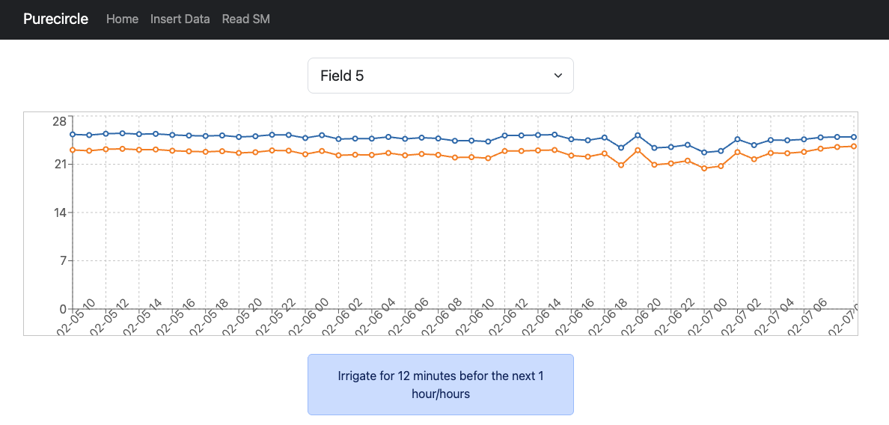

 &nbsp;&nbsp;&nbsp;&nbsp;


&nbsp;

&nbsp;
&nbsp;

# 🌾 Soil Moisture Forecasting and Irrigation Insights

This repository provide an AI based Decision Support System (DSS) for smart agriculture. This aciviti is part of the [PureCircle](https://purecircles.uni-hohenheim.de/en) project funded by [PRIMA](https://prima-med.org) program.


The provided software is devoted to the develop and deploy of AI based soil moisture forecasting system. The **University of Hohenheim** provided experimental field data collected at a **Moroccan research station** that have been processed by [CNR-ISASI](https://www.isasi.cnr.it).

- [Platform architecture](doc/platform.md)
- [Data collection and managment](doc/data.md)
- [Model architecute and Training](doc/training.md)
- [Database schema and description](doc/db.md)




---

## 🧭 Potential Applications

- Soil moisture and irrigation forecasting  
- Optimization of irrigation scheduling  
- Integration with weather forecasts for adaptive management  
- Crop growth modeling and yield prediction

---

## 🏗️ How to run the app.

In order to run the app you must run 3 different components:

- The Front-end
- The Back-end
- The Database

### Start Front-end

If not available install install npm and run the following commands

```npm install```

```npm install react-bootstrap bootstrap```


then access ```irrigation-frontend``` folder and run

```npm run dev````

Finally expose the front-end with ngrok by

```ngrok http --domain=purecircle.ngrok.app 5173````

check if the domain is available and the defoult port has been used.


### Back end

If not available create a conda environment and activate. Then install the following requirements:
```
pandas==3.0.0
fastapi==0.128.0
joblib==1.5.3
mysql-connector-python==9.6.0
numpy==2.4.1
openmeteo_requests==1.7.5
pydantic==2.12.5
python-dotenv==1.2.1
PyYAML==6.0.3
requests==2.32.5
scikit-learn==1.8.0
scipy==1.17.0
torch==2.10.0
uvicorn==0.40.0
```

then, from the project folder run

```uvicorn src.inference.api.src.app: app --reload```

end expose the back end on the dedicated ngrok domain

```ngrok http --domain=api-purecircle.ngrok.app 8000```

### Database

If not exist a new database must be instatiated and initialized. We chose to work with a docker container but obviously evry alternative is allowed.
To run the container for the fist time (name example second_season) run

```
docker run -d \                                       
  --name second_season \
  -e MYSQL_ROOT_PASSWORD=password \
  -e MYSQL_DATABASE=field_data \
  -p 3306:3306 \
  mysql:8.0
```

and access it with
```docker exec -it second_season mysql -u root -ppassword```

to execute the file db creation and table initialization 
```docker exec -i second_season mysql -u root -ppassword < create_query.sql```

The ```create_query.sql``` file contains the table initializatione relative to the second season, customize the file for a different configuration.

Data from each sensor are provided by the ```external_script.py``` id the db folder. The file is relative to the morocco pc. Please, modify the file depending on your parameters.

### Additional Notes

Some data like the mapping between sensor number and plot_id/sensor_zone are currently built in in the code and will be moved in the configuration file and env file.


---

**Authors:**  
Research collaboration between the **University of Hohenheim** and Moroccan research partners.  