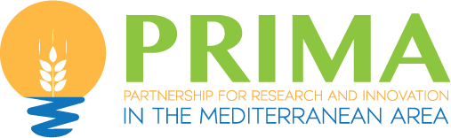

 &nbsp;&nbsp;&nbsp;&nbsp;

&nbsp;

&nbsp;
&nbsp;

# 🌾 Soil Moisture Forecasting and Irrigation Insights

This repository provide an AI based Decision Support System (DSS) for smart agriculture. This aciviti is part of the [PureCircle](https://purecircles.uni-hohenheim.de/en) project funded by [PRIMA](https://prima-med.org) program.

The provided software is devoted to the develop and deploy of AI based soil moisture forecasting system. The **University of Hohenheim** provided experimental field data collected at a **Moroccan research station** that have been processed by [CNR-ISASI](https://www.isasi.cnr.it).

- [Platform architecture](doc/platform.md)
- [Data collection and managment](doc/data.md)
- [Model architecute and Training](doc/training.md)
- [Database schema and description](doc/db.md)

---

## 🧭 Potential Applications

- Soil moisture and irrigation forecasting  
- Optimization of irrigation scheduling  
- Integration with weather forecasts for adaptive management  
- Crop growth modeling and yield prediction

---

## 🏗️ Future Extensions

- Inclusion of additional sensors or remote-sensing data  
- Integration with live APIs for real-time prediction  

---

**Authors:**  
Research collaboration between the **University of Hohenheim** and Moroccan research partners.  