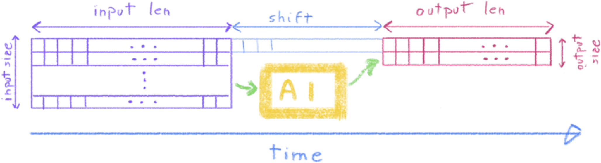
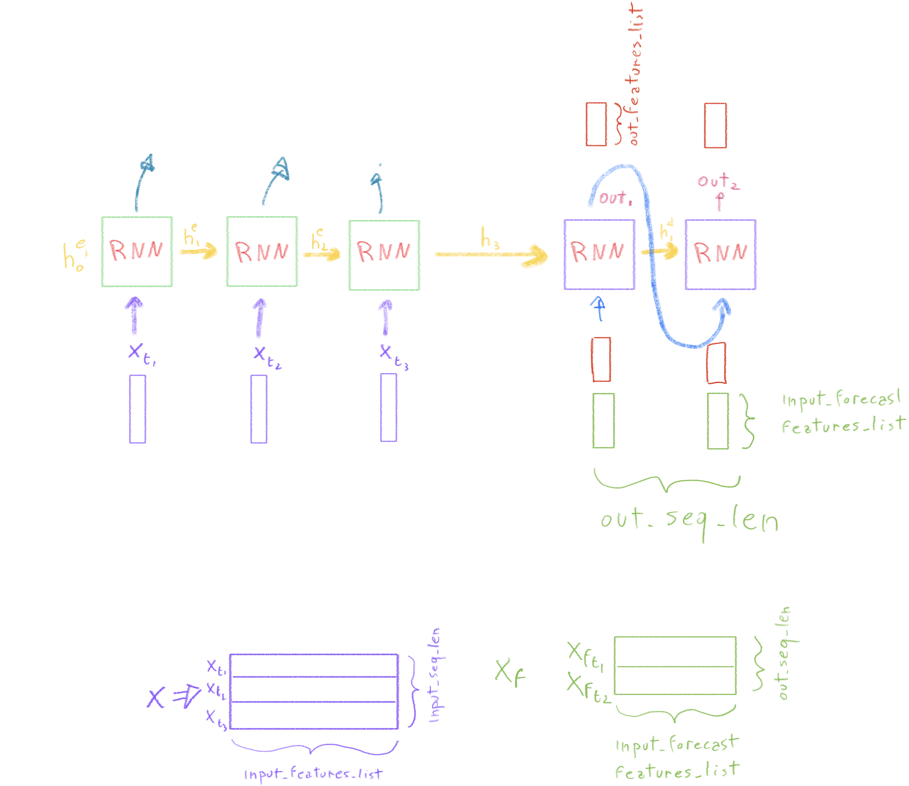

# 🌾 Quinoa Irrigation Data — University of Hohenheim Project

## 📘 Overview

The **University of Hohenheim** provided experimental field data collected at a **Moroccan research station**.  
The data have been collected with **three different irrigation management approaches** on **two quinoa varieties** under local field conditions.

---

## 💧 Irrigation Management Approaches

1. **CROPWAT** — Model-based irrigation scheduling  
2. **Sensor** — Real-time soil moisture–based irrigation  
3. **Farmer** — Traditional farmer-led irrigation decisions  

---

## 🌱 Quinoa Varieties

- **Titicaca**  
- **ICBA Q5**

Each combination of irrigation strategy and quinoa variety was monitored for multiple plots

---

## 📂 Provided Datasets

### 🧾 Original Files

| File | Description |
|------|--------------|
| **Soil_Moisture.xlsx** | Contains 36 sheets, each corresponding to a specific soil moisture sensor’s data. |
| **Irrigation_Events.xlsx** | Lists all irrigation events, including the involved fields and applied water volumes. |
| **Meteo_Station.xlsx** | Weather parameters recorded by the on-site meteorological station. |
| **LAI.xlsx** | Leaf Area Index (LAI) values sampled for each *Irrigation Mode × Quinoa Variety* pair. |

### 🌦️ Additional Source

| Source | Description |
|---------|--------------|
| **Open Meteo API** | Weather data obtained via the [Open-Meteo](https://open-meteo.com/) API. Enables integration of real-time weather conditions and forecasts. |

---

## 🧠 Data Modeling and Structure

The dataset is modeled to support **time series forecasting** using a **sequence-to-sequence (Encoder–Decoder) architecture**.  
This design allows the model to predict future soil and crop conditions given past observations.

### 🔢 Input/Output Parameters

| Parameter | Description |
|------------|-------------|
| **input len** | Number of past time steps used as input (length of observation window). |
| **input size** | Number of input features (e.g., soil moisture, irrigation events, solar radiation, temperature…). |
| **output len** | Number of future time steps to predict (forecast horizon). |
| **output size** | Number of target features to predict (e.g., soil moisture in and between crop rows). |
| **shift** | Temporal gap (in time steps) between the end of the input window and the start of the prediction window. A positive shift introduces a delay between observation and prediction. |

---

## 🧩 Network Architecture

The employed neural network follows an **Encoder–Decoder structure** that allows flexible, task-specific forecasting.  
The architecture can adapt to varying:
- Input and output sequence lengths  
- Numbers of input and output features  
- Shifts between observation and forecast windows  

This approach enables customized **ad-hoc forecasting** of environmental and crop variables under diverse irrigation regimes.

---

## 💻 Code Files

This repository contains the main scripts and notebooks used for **data preparation**, **model training**, and **result visualization**.  
Each component plays a specific role in the experimental workflow — from transforming raw field and meteorological data into structured datasets, to training predictive models and analyzing their performance.

| File | Description |
|------|--------------|
| **`createDataset.ipynb`** | Jupyter notebook that generates a **complete and clean dataset** (CSV format) for each experimental field. It reads and merges data from the provided `.xlsx` source files (soil moisture, irrigation events, meteorological data, and LAI) into unified time-series datasets ready for modeling. |
| **`run_experiments.py`** | Main Python script to **train forecasting models** using the prepared datasets. It handles data loading, model configuration, and training routines, and automatically saves the trained model weights into the `weights/` directory. |
| **`plotResults.py`** | Script for **visualizing and analyzing model outputs**. It loads predictions and observed data to produce performance plots (e.g., time series comparisons, error metrics, or evaluation summaries). Useful for assessing and comparing model performance across irrigation strategies and quinoa varieties. |

---

## 🧭 Potential Applications

- Soil moisture and irrigation forecasting  
- Optimization of irrigation scheduling  
- Integration with weather forecasts for adaptive management  
- Crop growth modeling and yield prediction

---

## 🏗️ Future Extensions

- Inclusion of additional sensors or remote-sensing data  
- Integration with live APIs for real-time prediction  

---

**Authors:**  
Research collaboration between the **University of Hohenheim** and Moroccan research partners.  