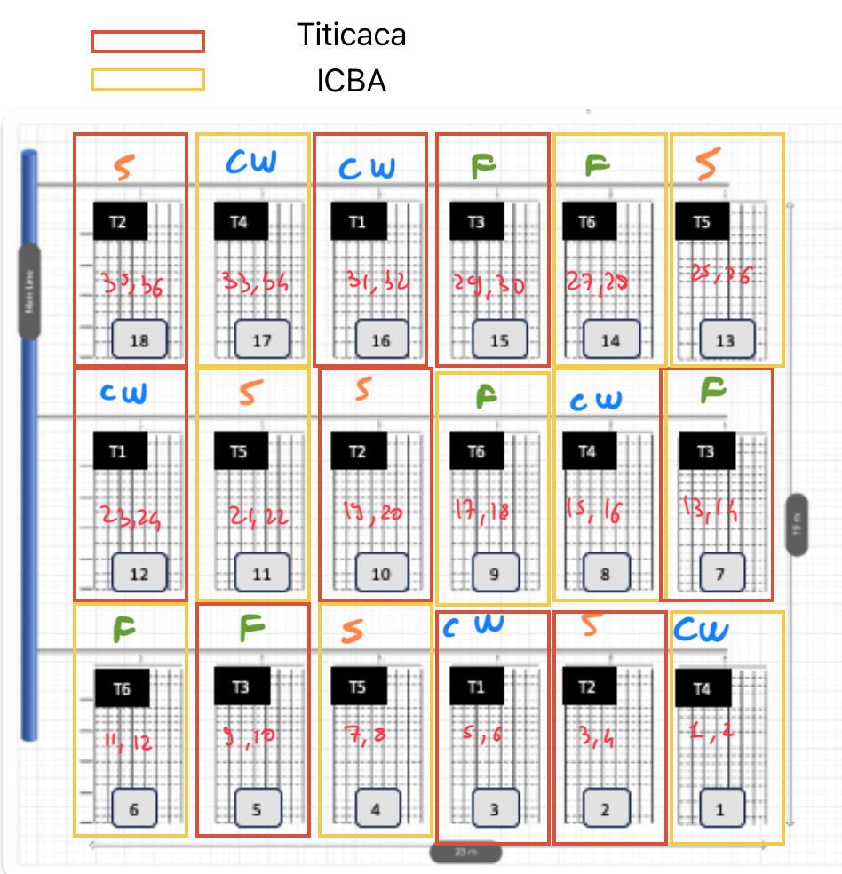

[Back to home](../README.md)

# Data Collection

The data collection campaign was carried out in the Morocco Living Labs following a controlled experimental design. Six experimental treatments were defined by the factorial combination of **three irrigation management** strategies and **two quinoa varieties**.

The experimental layout consisted of 18 subfields, with three independent replicates per treatment, to ensure adequate variability and statistical robustness. This design allowed the assessment of treatment-specific effects while mitigating the influence of field-level heterogeneity on the collected data.

---

## 💧 Irrigation Management Approaches

1. **CROPWAT** — Model-based irrigation scheduling  
2. **Sensor** — Real-time soil moisture–based irrigation  
3. **Farmer** — Traditional farmer-led irrigation decisions  

---

## 🌱 Quinoa Varieties

- **Titicaca**  
- **ICBA Q5**

---

## 📂 Provided Datasets

### 🧾 Original Files

| File | Description |
|------|--------------|
| **Soil_Moisture.xlsx** | Contains 36 sheets, each corresponding to a specific soil moisture sensor’s data. |
| **Irrigation_Events.xlsx** | Lists all irrigation events, including the involved fields and applied water volumes. |
| **Meteo_Station.xlsx** | Weather parameters recorded by the on-site meteorological station. |
| **LAI.xlsx** | Leaf Area Index (LAI) values sampled for each *Irrigation Mode × Quinoa Variety* pair. |

### 🌦️ Additional Source

| Source | Description |
|---------|--------------|
| **Open Meteo API** | Weather data obtained via the [Open-Meteo](https://open-meteo.com/) API. Enables integration of real-time weather conditions and forecasts. |