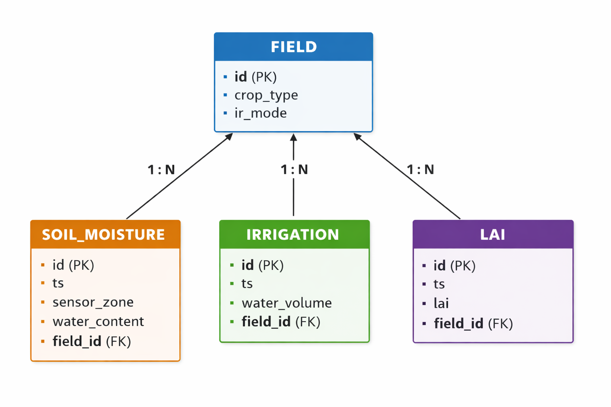

[Back to home](../README.md)

# Database System

The platform relies on a MySQL relational database, which stores all persistent data required for model training, inference, and DSS functionality. The database consists of four main tables:

- FIELD: Stores metadata related to the monitored agricultural fields (e.g., crop type, irrigation mode).

- SOIL_MOISTURE: Stores soil moisture measurements collected from sensors, including timestamps, sensor zone identifiers, and water content values.

- IRRIGATION: Records irrigation events performed on each field, including timestamps and water volumes.

- LAI: Stores Leaf Area Index measurements associated with each field and timestamp.

Each of the SOIL_MOISTURE, IRRIGATION, and LAI tables is linked to the FIELD table through a one-to-many (1:N) relationship, ensuring proper data normalization and traceability.

## Database Schema
The database schema reflects the logical structure described above and defines the relationships between fields, sensor measurements, irrigation events, and agronomic indicators.

## Database inizialitation

Dataset can be initialized with 
- create_query.sql: create the database 
- fill_fields.sql: fill the field table with information about fields under monitorin
- fill_data.sql: allow the insertion of historical or sintetic data