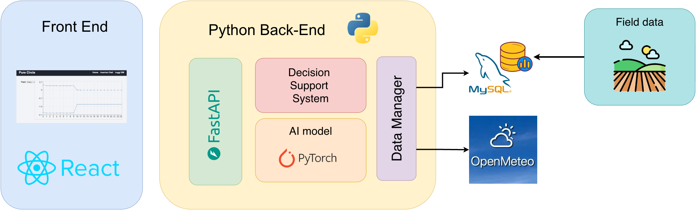

[Back to home](../README.md)

# AI Platform

The AI platform is composed of three main components, each designed to address a specific stage of the data lifecycle, from model training to end-user interaction. The system follows a modular and scalable architecture to support continuous model improvement, real-time inference, and seamless data management.

1. Training System
The Training System is the component responsible for dataset creation, model definition, and model training.
This module allows the user to define the entire machine learning pipeline through a configuration file, which represents a central element of the system. The configuration file specifies:
    - The input data format
    - The features to be extracted and used by the model
    - The model architecture (e.g., neural network type, layers, hyperparameters)
    - Training parameters (e.g., batch size, learning rate, number of epochs)

    The same configuration file is reused during the production phase, ensuring full consistency between training and inference.

    The training system is entirely developed in Python and is based on the PyTorch library, which is used for:
    - Model definition
    - Training loops
    - Loss computation
    - Model serialization and checkpointing

    This design enables flexibility in experimenting with different model architectures and supports reproducible training workflows.

2. Back-End System
The Back-End is responsible for exposing the Decision Support System (DSS), executing real-time model inference, and managing all data-related operations.
Its main responsibilities include:
    - Serving AI model predictions based on real-time or historical data
    - Providing DSS insights to support irrigation decisions
    - Handling data ingestion, including:
    - Reading and writing data to the database
    - Retrieving external data from online services (e.g., weather or environmental data sources)
    - Orchestrating communication between the database, AI models, and front-end

    The back-end is primarily developed in Python and leverages:
    - PyTorch for AI model inference
    - FastAPI to expose RESTful endpoints for data access, model predictions, and DSS services
    - FastAPI ensures high performance, automatic API documentation, and easy integration with the front-end layer.

3. Front-End System
    The Front-End provides the user-facing interface of the platform and enables interaction with forecasts, DSS outputs, and data entry services.
    It is currently composed of the following pages:

    - Landing Page: Entry point to the platform

    - Soil Moisture Forecast & DSS Page:
        - Visualization of soil moisture predictions
        - Display of DSS insights for irrigation management

    - Data Insertion Page:
    - Manual input of irrigation events
    - Entry of LAI (Leaf Area Index) measurements

    The front-end is developed using React, enabling:
    - A responsive and modular UI
    - Easy integration with REST APIs
    - Future scalability and UI/UX enhancements

    The current implementation is designed to support additional features such as advanced data visualization, user authentication, and role-based access control.